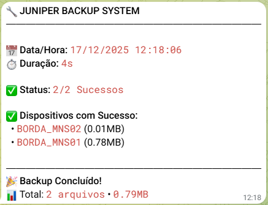

# Juniper Container Backup


Born from the need for a **secure** and **scalable** backup solution. This project automates the backup of Juniper (Junos) devices running in a hardened, non-root Docker container.

## 🚀 Features

- **Juniper Support**: Dedicated support for Juniper Junos devices.
- **Inventory Management**: Configure devices easily via `inventory.yaml`.
- **Git Integration**: Automatically commits changes to a local Git repository, allowing version history tracking of configurations.
- **Secure**: Runs as a non-privileged user (`appuser`) inside the container.
- **Notifications**: Sends Telegram alerts on job success or failure.
- **Scheduled**: Built-in Python scheduler (no system cron required).
- **Parallel**: Backs up multiple devices simultaneously.
- **Resilient**: Automatic retry with exponential backoff for network failures.
- **Validated**: Schema validation for configuration files.
- **Monitored**: Built-in healthcheck for container monitoring.

### 📱 Telegram Notification Example



## 📋 Prerequisites

- Docker & Docker Compose
- Network access to devices (SSH)

## 🛠️ Configuration

### 1. Environment Variables
Create a `.env` file based on `.env.example`:

```bash
cp .env.example .env
```

| Variable | Description | Default |
|----------|-------------|---------|
| `BACKUP_TIME` | Daily backup time (HH:MM). Overrides interval. | - |
| `BACKUP_INTERVAL_MINUTES` | Frequency of backups in minutes (if time not set) | `60` |
| `MAX_BACKUPS` | Number of local files to keep per device | `10` |
| `BACKUP_DIR` | Internal container path for backups | `/backups` |
| `LOG_FILE` | Path to log file | `/var/log/backup.log` |
| `TELEGRAM_BOT_TOKEN` | Token for Telegram Bot | - |
| `TELEGRAM_CHAT_ID` | Chat ID for notifications | - |
| `JUNIPER_USERNAME` | Default username if not in inventory | - |
| `JUNIPER_PASSWORD` | Default password if not in inventory | - |

### 2. Device Inventory
Edit `inventory.yaml` to add your devices:

```yaml
routers:
  - host: 10.0.0.1
    username: admin
    password: mypassword
    port: 22

  - host: 10.0.0.2
    username: admin
    password: mypassword
    port: 22
```

> [!IMPORTANT]
> **Security Check**: Before committing, verify no sensitive data is exposed:
> ```bash
> ./scripts/check-security.sh
> ```
> See [docs/SECURITY.md](docs/SECURITY.md) for complete security guidelines.


## 🏃 Usage

### Build and Run
```bash
docker compose up -d
```

### View Logs
```bash
docker compose logs -f
# Or view logs on host:
tail -f logs/backup.log
```

### Run Manually (One-off)
```bash
docker exec juniper-backup python /app/run_backup.py
```

## 📂 Directory Structure

```
juniper-container-backup/
├── src/
│   └── backup.py           # Main backup logic
├── scripts/
│   └── check-security.sh   # Security verification script
├── docs/
│   ├── SECURITY.md         # Security guidelines
│   └── telegram_notification_example.png
├── backups/                # Git repository for configs (auto-created)
├── logs/                   # Log files (auto-created)
├── healthcheck.py          # Container health monitoring
├── run_backup.py           # Manual backup execution
├── inventory.yaml          # Device list (create from example)
├── inventory.example.yaml  # Template for inventory
├── .env                    # Environment variables (create from example)
├── .env.example            # Template for environment
├── Dockerfile              # Container definition
├── docker-compose.yml      # Orchestration
├── requirements.txt        # Python dependencies
└── README.md               # This file
```

## 🔍 Monitoring

**Check container health:**
```bash
docker inspect --format='{{.State.Health.Status}}' juniper-backup
docker compose logs -f
```

**Health states:** `healthy` | `unhealthy` | `starting`

## ⏰ Scheduling

**Two modes available:**

1. **Fixed Time** (daily): `BACKUP_TIME=22:00`
2. **Interval** (periodic): `BACKUP_INTERVAL_MINUTES=60`

> [!NOTE]
> - Container must stay running (`docker compose up -d`)
> - Backup runs **only on schedule** (not on startup)
> - For immediate backup: `docker exec juniper-backup python src/backup.py`

## 🛡️ Security

**Container:** Runs as non-root user (`appuser`)  
**Credentials:** See [SECURITY.md](SECURITY.md) for best practices  
**Verification:** Run `./check-security.sh` before commits

**Production recommendations:**
- Use Docker Secrets (Swarm) or Kubernetes Secrets
- Integrate HashiCorp Vault for dynamic credentials
- Set file permissions: `chmod 600 .env inventory.yaml`

## 📊 Features

**Retry Mechanism:** 3 attempts with exponential backoff (4s → 8s → 16s)  
**Validation:** Automatic schema validation for `inventory.yaml`  
**Git Versioning:** Every backup creates a commit  
**Parallel Execution:** Up to 10 devices simultaneously

---

**For detailed troubleshooting and advanced configuration, see [SECURITY.md](SECURITY.md)**

